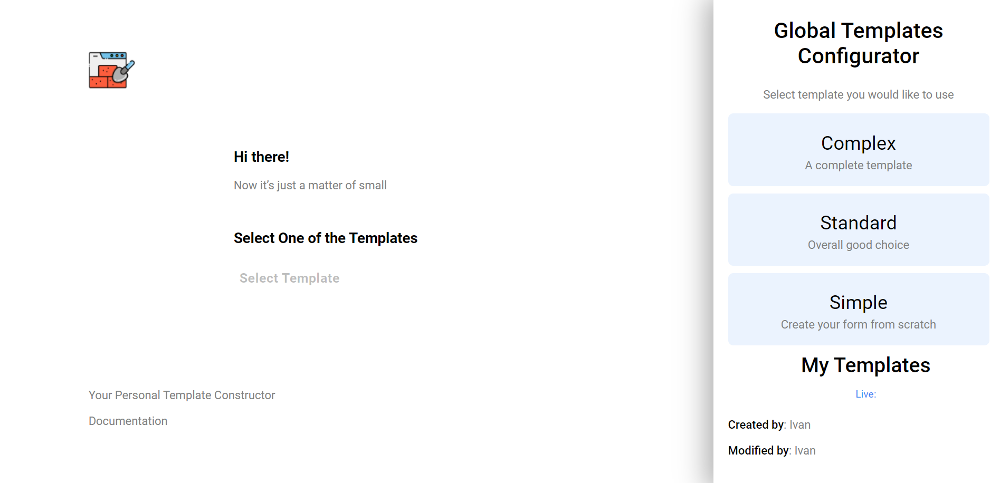
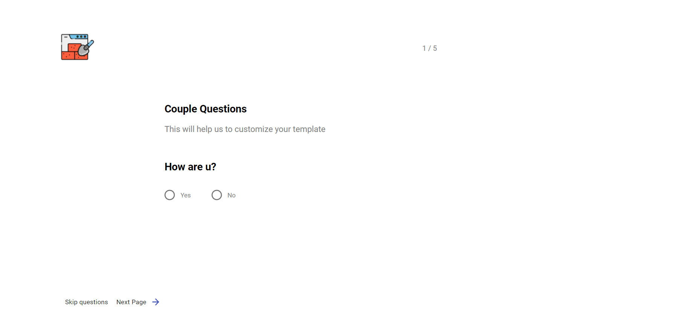
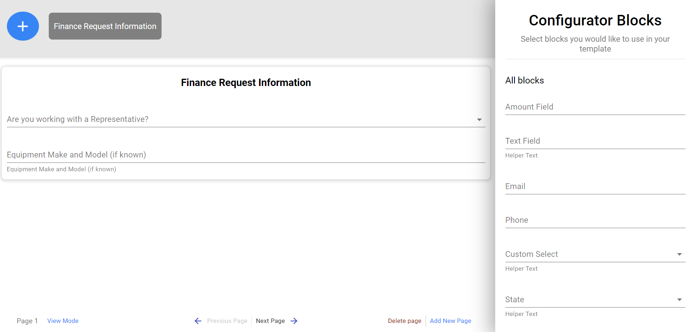

# Form Constructor
This application allows you to create your own form by dragging and dropping elements on the page. You will be able to add/remove/move fields or sections on the page.  You can also customize each element that you create (change the label, validation rules, field name, etc.)

Enjoy your use!

# Pages 

### Main Page

### Select Template
On this page you can choose from ready-made templates for creating a form (Complex, Standard, Simple).

### Questionnaire
Before creating a form, you can add a questionnaire and build your own form from the results of the answers.

 ### Constructor
In the constructor, you create your form by dragging elements on the page.

# Stack Technologies

- React
- React-Router
- Material UI
- react dnd
- lodash

# Testing

To test the application, you need to enter the following commands:

You need to clone the repository using the command:`git@github.com:ToxichQQQ/form-constructor.git`

After the repository has been copied, go to the repository and run the `npm install` command.

Start the application using the `npm start`

# Thanks for your attention

You can contact me by this email storozhenko.dev@gmail.com
